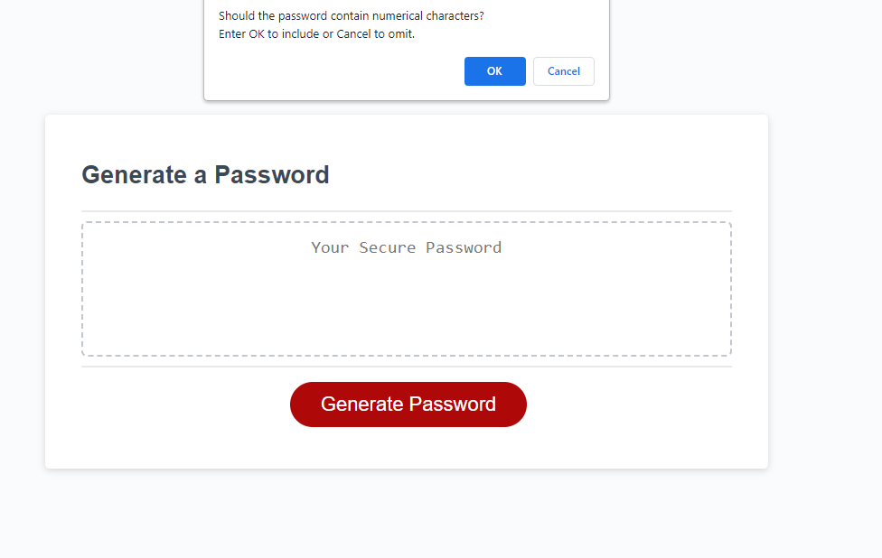

# Password Generator

## Description

This challenge involves creating a JavaScript script that generates a random password for the user after a series of prompts. The following Acceptance Criteria is met:

```
GIVEN I need a new, secure password
WHEN I click the button to generate a password
THEN I am presented with a series of prompts for password criteria
WHEN prompted for password criteria
THEN I select which criteria to include in the password
WHEN prompted for the length of the password
THEN I choose a length of at least 8 characters and no more than 128 characters
WHEN asked for character types to include in the password
THEN I confirm whether or not to include lowercase, uppercase, numeric, and/or special characters
WHEN I answer each prompt
THEN my input should be validated and at least one character type should be selected
WHEN all prompts are answered
THEN a password is generated that matches the selected criteria
WHEN the password is generated
THEN the password is either displayed in an alert or written to the page
```

The webpage looks as following:

## Initial page


## Example of a prompt


## Password generated outcome


## Installation

No Installation is needed to view and use this webpage.

## Usage

In order to access the refactored website, visit:

https://cornetj13.github.io/password-generator/

## Credits

This project was designed by the UW fullstack bootcamp and was fully implemented by me. I referenced W3 Schools for JavaScript methods and functionality:

https://www.w3schools.com/

## License

Please refer to the LICENSE in the repo.
